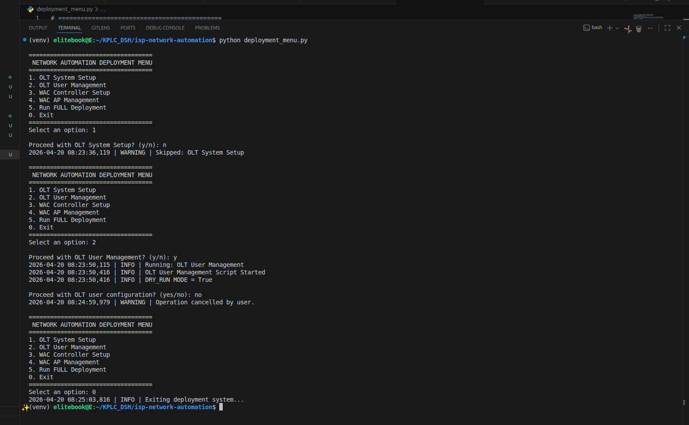

# 📡 ISP NETWORK AUTOMATION FRAMEWORK (OLT + WAC)


## Project Overview

This project is an **ISP Network Automation Framework** designed to automate configuration and management of core ISP infrastructure.

It standardizes deployment across multiple sites for:

* Optical Line Terminals (OLT) – Fiber access layer
* Wireless Access Controllers (WAC) – Wireless network layer
* VLAN segmentation and service isolation
* User provisioning and secure access setup
* Device initialization and baseline configuration

The system replaces repetitive manual CLI configuration with automated, repeatable deployment scripts, improving speed, accuracy, and consistency.

### Screenshort image of project


## Network Architecture

```text
                         INTERNET
                             │
                     ┌───────▼────────┐
                     │    ISP CORE     │
                     └───────┬────────┘
                             │
          ┌──────────────────┴──────────────────┐
          │                                     │
   ┌──────▼──────┐                     ┌───────▼────────┐
   │     OLT      │                     │      WAC        │
   │ Fiber Access │                     │ WiFi Controller │
   └──────┬──────┘                     └───────┬────────┘
          │ GPON                               │ CAPWAP
   ┌──────▼────────┐                 ┌────────▼────────┐
   │   ONT Devices  │               │  Access Points   │
   └──────┬────────┘                 └────────┬────────┘
          │                                  │
     End Users (LAN)              Wireless Clients (WiFi)
```

## Key Features

### 🔹 OLT Automation (Fiber Layer)

* System initialization (hostname, timezone, alarms)
* VLAN provisioning and service segmentation
* Secure user and SSH configuration
* GPON-ready baseline setup
* ISP-grade management isolation

### 🔹 WAC Automation (Wireless Layer)

* Wireless controller initialization
* VLAN mapping for services
* CAPWAP configuration for AP management
* DHCP, DNS, and STP activation
* Secure trunk and management configuration

## Technology Stack

* Python 3.10+
* Netmiko (SSH automation)
* Paramiko (secure device communication)
* Huawei OLT & WAC CLI
* VLAN, GPON, CAPWAP networking standards

## Project Structure

```text
isp-network-automation/
│
├── olt/
│   ├── olt_system_setup.py
│   ├── olt_user_management.py
│
├── wac/
│   ├── wac_controller_setup.py
│   ├── wac_ap_management.py
│
├── configs/
│   ├── olt_reference_config.txt
│   ├── wac_reference_config.txt
│
├── diagrams/
│   ├── explanation.png
│   ├── implementation.png
│
├── deployment_menu.py   # MAIN ENTRY POINT
├── requirements.txt
├── README.md
├── LICENSE
└── CHANGELOG.md
```

## Deployment Guide

### 1. Clone Repository

```bash
git clone https://github.com/your-org/isp-network-automation.git
cd isp-network-automation
```

### 2. Create Virtual Environment

```bash
python -m venv venv
venv\Scripts\activate   # Windows
source venv/bin/activate  # Linux/Mac
```

### 3. Install Dependencies

```bash
pip install -r requirements.txt
```

### 4. Run Deployment System

```bash
python deployment_menu.py
```

## Execution Flow

When executed, the system supports step-by-step deployment:

1. OLT system initialization
2. OLT user and SSH configuration
3. WAC controller setup
4. WAC AP provisioning
5. Service readiness validation

Each step requires **user confirmation before execution**.


## Security & Best Practices

* Default credentials must be changed before production use
* SSH is enforced for secure device access
* VLAN segmentation ensures service isolation
* Management VLAN is isolated from user traffic
* Role-based access control supported via user configuration


## Business Use Cases

This framework is applicable in:

* FTTH (Fiber-To-The-Home) deployments
* Enterprise WiFi infrastructure
* Smart campus networks
* ISP multi-site rollout standardization
* Managed service provider (MSP) operations


## Operational Benefits

* Reduces manual configuration time
* Minimizes human CLI errors
* Ensures consistent ISP deployment standards
* Supports repeatable multi-site installations
* Improves operational efficiency for engineers


## Project Status

* ✔ Production-ready structure
* ✔ Modular and scalable design
* ✔ ISP deployment validated workflow
* 🚧 Future enhancement: Web dashboard + API automation layer


## Author

**Eric Nzyoka**
* Network Automation Engineer
* ISP Infrastructure & Backend Systems


# Simple example

If someone asks:

> “How do you run the system?”

You answer:

```bash
python deployment_menu.py
```

Then you select:

* `1` → OLT setup
* `2` → OLT users
* `5` → full deployment

Each step asks:

```text
Proceed? (y/n)
```